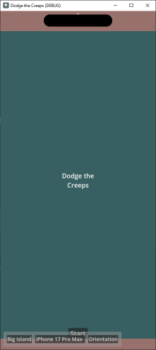

# iOS Layout Tester

iOS screen layout tester addon for Gotdot 4.x.

Exporting projects for iOS takes a while to compile, so this addon makes it easy to check layouts will work on iOS devices ahead of time.
Simply install the addon and then add a new node of type XXX to the root of your main scene, and hit play.

The buttons at the bottom of the screen allow you to switch between different device dimensions and screen orientations.

Apple "safe areas" are shown with transparent pink shading. Dynamic island, notch adn screen corners are shown for each screen layout.

Demo project: https://github.com/iamcal/godot-ios-layout-tester-example